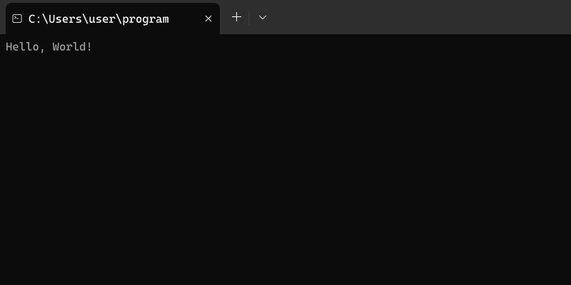

# Terminal Screenshot Generator

This is a simple script that generates a terminal screenshot.

## Usage

0. Clone the repository by running `git clone https://github.com/swastikians/terminal-screenshot-generator` command.
1. Navigate to the cloned repository by running `cd terminal-screenshot-generator` command.
2. Install the dependencies by running `npm install` command.
3. Modify the `src/names.ts` file for the name to be displayed in the terminal.
4. Modify `src/outputs.ts` file for the output to be displayed in the terminal.
5. Run `npm run generate` command

The generated images will be inside the `output` folder.
